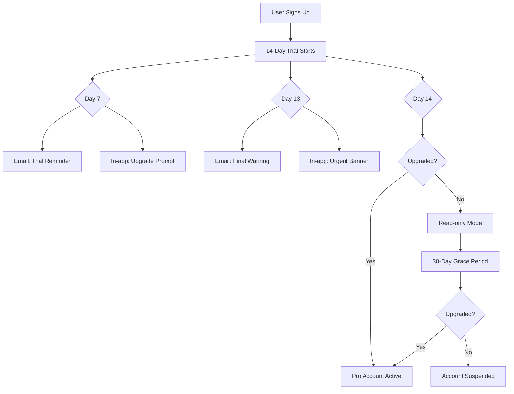

# Product Requirements Document (PRD)
## Construction Plan Viewer - Mobile-First SaaS Platform

**Version:** 1.0  
**Date:** September 2025  
**Target Markets:** Canada & United States

---

## Executive Summary

A streamlined mobile application designed specifically for small construction businesses (rebar contractors, small builders, specialty trades) who need quick, efficient access to high-resolution construction plans on-site without the complexity and cost of enterprise solutions like Fieldwire or PlanGrid. The platform focuses on simplicity, speed, and essential features while eliminating unnecessary project management overhead.

### Key Differentiators
- **Sheet linking** - One-click navigation between related drawings (critical feature)
- **High-resolution viewing** - Essential for reading dimensions and technical details
- **Offline-first architecture** - Reliable access on construction sites with poor connectivity
- **Simple pricing** - 80% cheaper than enterprise alternatives
- **60-second setup** - Upload plans and share in under a minute

---

## Problem Statement

Small construction businesses are underserved by existing construction management software:
- **Over-engineered solutions**: Current tools offer extensive project management features that small contractors never use
- **High costs**: Enterprise solutions cost $200-500/month
- **Training requirements**: Complex interfaces require significant onboarding
- **Poor offline support**: Existing tools fail on construction sites with spotty connectivity

### What Small Contractors Actually Need
- View high-resolution plans on mobile devices
- Navigate between linked sheets quickly
- Capture photos/videos tied to specific plan locations
- Share access with field workers temporarily
- Work reliably offline
- Simple, disposable projects that can be deleted when complete

---

## Target Users

### Primary Users
- **Small construction business owners** (1-20 employees)
- **Foremen and site supervisors**
- **Specialty trades** (rebar, electrical, plumbing, HVAC)
- **Typical projects**: Residential, small commercial, renovation work

### User Characteristics
- **Technical proficiency**: Low to moderate
- **Device preference**: Personal smartphones (iOS/Android)
- **Work environment**: Outdoor construction sites with limited connectivity
- **Budget conscious**: Looking for value, not enterprise features

---

## Core Features & Requirements

### 1. Plan Management

#### 1.1 Upload & Processing Pipeline
```
Upload Flow:
1. Admin uploads PDF plans
2. System processes with Sharp library
3. Generate Deep Zoom Image (DZI) tiles
4. Create tile pyramid (256x256px tiles)
5. Store in R2 with CDN distribution
6. Generate thumbnail previews
```

**Technical Requirements:**
- Support PDF format (MVP)
- Maximum file size: 500MB per plan
- Processing time: < 30 seconds per sheet
- OpenSeadragon integration for high-res viewing
- Maintain original quality for technical drawings

#### 1.2 Sheet Linking System
**Critical differentiator** - The primary reason users would choose this over competitors

**Implementation:**
- Admin defines clickable regions on plans
- Links connect to other sheets in project
- Visual indicators for linked areas
- Instant navigation (< 500ms response time)

**Link Types:**
- Detail callouts → Detail sheets
- Section cuts → Section drawings  
- Elevation markers → Elevation sheets
- General cross-references

#### 1.3 High-Resolution Viewer
**Built with OpenSeadragon + Expo DOM Components**
- Smooth pan/zoom with gesture support
- Offline tile caching strategy
- Progressive download of tile pyramids
- Minimal UI overlay (maximize screen space)

### 2. Media Capture & Annotations

#### 2.1 Photo/Video Capture
- **Location-tied**: All media linked to (x,y) coordinates on plans
- **Native camera**: Direct integration with device camera
- **Metadata**: Timestamp, user, coordinates, sheet reference
- **Queue system**: Offline capture with sync when connected
- **Storage**: Original quality photos, compressed videos

#### 2.2 Simple Annotations
- **MVP Feature**: Circle tool only
- **Colors**: Red (issue), Yellow (attention), Green (complete)
- **Sync**: Real-time when online, queued when offline
- **No complex markup** - Not competing with full annotation suites

### 3. Access Control & Project Lifecycle

#### 3.1 Permission Model
```
Roles:
- Owner: Full control, billing, delete rights
- Admin: Upload media, create annotations
- Viewer: Read-only access
```

#### 3.2 Sharing Mechanism
- **Quick share links**: No account required for viewers
- **Expiring access**: Links auto-expire after project completion
- **No complex invitations**: Simple URL sharing

#### 3.3 Project Lifecycle
- **Quick creation**: < 60 seconds from upload to share
- **Disposable**: Easy bulk delete when job complete
- **No archival complexity**: This isn't document management

---

## Technical Architecture

### Infrastructure Stack

**Primary**: Cloudflare Developer Platform (Edge-first architecture)

| Component | Technology | Justification |
|-----------|------------|---------------|
| **API** | Cloudflare Workers | Serverless, auto-scaling, global edge |
| **Database** | D1 (SQLite at edge) | Low latency, perfect for metadata |
| **File Storage** | R2 | S3-compatible, no egress fees |
| **Cache Layer** | KV Store | Session management, temporary data |
| **CDN** | Cloudflare CDN | Global tile distribution |
| **Observability** | Baselime (Cloudflare) | Native integration, serverless-optimized |
| **Real-time** | Durable Objects (Future) | Cursor sharing, live annotations |

### Multi-Tenant Database Architecture

```sql
-- Core tenant structure
CREATE TABLE organizations (
  id TEXT PRIMARY KEY,
  name TEXT NOT NULL,
  owner_email TEXT UNIQUE NOT NULL,
  subscription_tier TEXT DEFAULT 'trial', -- trial|pro|enterprise
  subscription_status TEXT DEFAULT 'trialing', -- trialing|active|past_due|cancelled
  trial_ends_at TIMESTAMP,
  stripe_customer_id TEXT,
  stripe_subscription_id TEXT,
  mrr INTEGER DEFAULT 0, -- Monthly recurring revenue in cents
  seats_used INTEGER DEFAULT 1,
  seats_limit INTEGER DEFAULT 3,
  storage_used_bytes INTEGER DEFAULT 0,
  storage_limit_bytes INTEGER,
  current_period_ends_at TIMESTAMP,
  created_at TIMESTAMP DEFAULT CURRENT_TIMESTAMP,
  updated_at TIMESTAMP DEFAULT CURRENT_TIMESTAMP
);

-- User management
CREATE TABLE users (
  id TEXT PRIMARY KEY,
  clerk_user_id TEXT UNIQUE, -- Clerk auth reference
  email TEXT NOT NULL,
  name TEXT,
  phone TEXT,
  org_id TEXT REFERENCES organizations(id),
  role TEXT DEFAULT 'member', -- owner|admin|member
  last_active_at TIMESTAMP,
  created_at TIMESTAMP DEFAULT CURRENT_TIMESTAMP,
  updated_at TIMESTAMP DEFAULT CURRENT_TIMESTAMP,
  INDEX idx_users_org (org_id),
  INDEX idx_users_clerk (clerk_user_id)
);

-- Project management
CREATE TABLE projects (
  id TEXT PRIMARY KEY,
  org_id TEXT REFERENCES organizations(id),
  name TEXT NOT NULL,
  description TEXT,
  created_by TEXT REFERENCES users(id),
  is_archived BOOLEAN DEFAULT FALSE,
  deleted_at TIMESTAMP,
  share_token TEXT UNIQUE, -- For quick sharing
  created_at TIMESTAMP DEFAULT CURRENT_TIMESTAMP,
  updated_at TIMESTAMP DEFAULT CURRENT_TIMESTAMP,
  INDEX idx_projects_org (org_id),
  INDEX idx_projects_share (share_token)
);

-- Sheet/Plan storage
CREATE TABLE sheets (
  id TEXT PRIMARY KEY,
  project_id TEXT REFERENCES projects(id),
  org_id TEXT, -- Denormalized for performance
  name TEXT NOT NULL,
  sheet_number TEXT,
  original_file_key TEXT, -- R2 reference
  dzi_metadata JSON, -- Tile structure info
  thumbnail_key TEXT, -- R2 reference
  width INTEGER,
  height INTEGER,
  tile_size INTEGER DEFAULT 256,
  max_zoom_level INTEGER,
  processing_status TEXT DEFAULT 'pending', -- pending|processing|complete|failed
  created_at TIMESTAMP DEFAULT CURRENT_TIMESTAMP,
  updated_at TIMESTAMP DEFAULT CURRENT_TIMESTAMP,
  INDEX idx_sheets_project (project_id),
  INDEX idx_sheets_org (org_id)
);

-- Sheet linking (Critical feature)
CREATE TABLE sheet_links (
  id TEXT PRIMARY KEY,
  org_id TEXT, -- Denormalized
  project_id TEXT, -- Denormalized
  from_sheet_id TEXT REFERENCES sheets(id),
  to_sheet_id TEXT REFERENCES sheets(id),
  coordinates JSON, -- {x, y, width, height} in pixels
  label TEXT,
  color TEXT DEFAULT '#0066CC',
  created_by TEXT REFERENCES users(id),
  created_at TIMESTAMP DEFAULT CURRENT_TIMESTAMP,
  INDEX idx_links_from (from_sheet_id),
  INDEX idx_links_to (to_sheet_id)
);

-- Media captures
CREATE TABLE media_captures (
  id TEXT PRIMARY KEY,
  org_id TEXT, -- Denormalized
  project_id TEXT REFERENCES projects(id),
  sheet_id TEXT REFERENCES sheets(id),
  type TEXT NOT NULL, -- photo|video
  file_key TEXT, -- R2 reference
  thumbnail_key TEXT, -- For videos
  coordinates JSON, -- {x, y} on sheet
  description TEXT,
  captured_by TEXT REFERENCES users(id),
  device_info JSON, -- Device type, OS version
  sync_status TEXT DEFAULT 'pending', -- pending|synced|failed
  created_at TIMESTAMP DEFAULT CURRENT_TIMESTAMP,
  synced_at TIMESTAMP,
  INDEX idx_media_sheet (sheet_id),
  INDEX idx_media_sync (sync_status)
);

-- Annotations
CREATE TABLE annotations (
  id TEXT PRIMARY KEY,
  org_id TEXT, -- Denormalized
  sheet_id TEXT REFERENCES sheets(id),
  type TEXT DEFAULT 'circle', -- circle only for MVP
  color TEXT NOT NULL, -- red|yellow|green
  coordinates JSON, -- {cx, cy, radius} for circles
  created_by TEXT REFERENCES users(id),
  created_at TIMESTAMP DEFAULT CURRENT_TIMESTAMP,
  updated_at TIMESTAMP DEFAULT CURRENT_TIMESTAMP,
  INDEX idx_annotations_sheet (sheet_id)
);

-- Usage tracking for billing
CREATE TABLE usage_events (
  id TEXT PRIMARY KEY,
  org_id TEXT REFERENCES organizations(id),
  event_type TEXT NOT NULL, -- project_created|sheet_uploaded|media_uploaded
  metadata JSON,
  created_at TIMESTAMP DEFAULT CURRENT_TIMESTAMP,
  INDEX idx_usage_org_date (org_id, created_at)
);
```

### Storage Architecture (R2)

```
/orgs/{org_id}/
  /projects/{project_id}/
    /sheets/{sheet_id}/
      /original.pdf           # Original upload
      /tiles/                 # DZI tile pyramid
        /{level}/
          /{column}_{row}.jpg
      /thumbnail.jpg          # List view preview
    /media/
      /photos/
        /{capture_id}.jpg     # Full resolution
        /{capture_id}_thumb.jpg
      /videos/
        /{capture_id}.mp4
        /{capture_id}_thumb.jpg
```

### Authentication Strategy

**Provider**: Clerk (Selected over alternatives)

**Why Clerk:**
- Free for first 10,000 monthly active users and 100 monthly active orgs
- Pre-built UI components for rapid development
- Native Expo/React Native support
- SOC 2 Type II compliant
- Better developer experience than Auth0
- More cost-effective than Better Auth for small teams

**Implementation:**
```javascript
// Clerk integration with Cloudflare Workers
export async function authenticate(request, env) {
  const clerk = new Clerk({ 
    secretKey: env.CLERK_SECRET_KEY 
  });
  
  const session = await clerk.verifySession(
    request.headers.get('Authorization')
  );
  
  if (!session) throw new Error('Unauthorized');
  
  // Get user with org context
  const user = await env.DB.prepare(`
    SELECT u.*, o.subscription_status, o.subscription_tier
    FROM users u
    JOIN organizations o ON u.org_id = o.id
    WHERE u.clerk_user_id = ?
  `).bind(session.userId).first();
  
  request.user = user;
  request.orgId = user.org_id;
  return request;
}
```

### Payment Processing

**Provider**: Polar (Selected over Stripe)

**Why Polar:**
- Open source, developer-first, and focused on simplicity
- 4% + 40¢ per transaction all-inclusive (includes tax handling)
- Merchant of Record - handles all tax compliance
- Streamlined customer lifecycle management with detailed profiles and analytics
- Better for SaaS than raw Stripe implementation
- Simpler than Stripe for subscription management

**Pricing Comparison for $10,000 MRR:**
- Stripe: ~$290 (2.9%) + tax compliance costs + development time
- Polar: $400 (4%) all-inclusive with tax handling

### Observability & Monitoring

**Primary**: Baselime (Now part of Cloudflare)

**Why Baselime:**
- Cloudflare has acquired Baselime, a serverless observability company
- Native Cloudflare Workers integration
- Real-time error tracking based on logs and traces
- OpenTelemetry support
- Designed for serverless architectures

**Secondary**: Grafana Cloud (Optional)
- For custom dashboards
- 5 useful alerts and 3 pre-built dashboards to help monitor and visualize Cloudflare metrics
- Free tier available

---

## Subscription Tiers & Pricing

### Pricing Strategy (14-day Free Trial, No Free Tier)

| Feature | **Trial** | **Pro** ($49/mo) | **Enterprise** ($149/mo) |
|---------|-----------|-------------------|--------------------------|
| **Duration** | 14 days | Unlimited | Unlimited |
| **Projects** | 2 active | Unlimited | Unlimited |
| **Team Members** | 3 | 20 | Unlimited |
| **Storage** | 1 GB | 100 GB | 1 TB |
| **Sheets per Project** | 20 | Unlimited | Unlimited |
| **Media Retention** | 30 days | Unlimited | Unlimited |
| **Sheet Linking** | ✅ | ✅ | ✅ |
| **Offline Mode** | ✅ | ✅ | ✅ |
| **Priority Support** | ❌ | Email | Phone + Email |
| **API Access** | ❌ | ❌ | ✅ |
| **Custom Branding** | ❌ | ❌ | ✅ |
| **SSO** | ❌ | ❌ | Coming Soon |
| **Audit Logs** | ❌ | ❌ | ✅ |

### Enforcement Logic

```javascript
// Subscription enforcement middleware
export async function enforceSubscriptionLimits(request, env) {
  const { orgId, tier } = request.user;
  
  // Check trial expiration
  if (tier === 'trial') {
    const org = await getOrganization(orgId, env);
    if (new Date() > new Date(org.trial_ends_at)) {
      throw new Error('Trial expired. Please upgrade to continue.');
    }
  }
  
  // Enforce storage limits
  const usage = await calculateStorageUsage(orgId, env);
  const limits = TIER_LIMITS[tier];
  if (usage > limits.storage) {
    throw new Error('Storage limit exceeded. Please upgrade your plan.');
  }
  
  // Check project limits
  if (request.path.includes('/projects/create')) {
    const projectCount = await getProjectCount(orgId, env);
    if (tier === 'trial' && projectCount >= 2) {
      throw new Error('Project limit reached. Upgrade to Pro for unlimited projects.');
    }
  }
}
```

---

## Mobile App Architecture

### Technology Stack
- **Framework**: React Native with Expo
- **Rendering**: Expo DOM Components for OpenSeadragon
- **State Management**: Zustand
- **Offline Storage**: SQLite + React Native File System
- **Auth**: Clerk React Native SDK

### Caching Strategy

#### Tile Caching Architecture
```javascript
class TileCache {
  constructor() {
    this.cacheDir = `${RNFS.DocumentDirectoryPath}/tiles`;
    this.maxCacheSize = this.getMaxCacheSizeForTier();
  }
  
  async downloadSheetTiles(projectId, sheetId, priority = 'visible') {
    const dziMeta = await this.fetchDZIMetadata(projectId, sheetId);
    
    switch(priority) {
      case 'visible':
        // Download currently visible tiles first
        await this.downloadVisibleTiles(dziMeta);
        break;
      case 'adjacent':
        // Pre-fetch nearby tiles
        await this.downloadAdjacentTiles(dziMeta);
        break;
      case 'full':
        // Download entire pyramid for offline
        await this.downloadFullPyramid(dziMeta);
        break;
    }
  }
  
  async downloadFullPyramid(dziMeta) {
    const { maxLevel, tileSize } = dziMeta;
    const downloads = [];
    
    // Progressive download from low to high resolution
    for (let level = 0; level <= maxLevel; level++) {
      const tilesAtLevel = Math.pow(2, level);
      
      for (let col = 0; col < tilesAtLevel; col++) {
        for (let row = 0; row < tilesAtLevel; row++) {
          const remotePath = `/tiles/${level}/${col}_${row}.jpg`;
          const localPath = `${this.cacheDir}/${projectId}/${sheetId}${remotePath}`;
          
          downloads.push(this.downloadTile(remotePath, localPath));
        }
      }
      
      // Download level by level to show progress
      await Promise.all(downloads);
      this.updateProgress(level / maxLevel);
      downloads.length = 0;
    }
  }
  
  getMaxCacheSizeForTier() {
    const tier = getUserTier();
    const limits = {
      trial: 500_000_000,      // 500 MB
      pro: 2_000_000_000,      // 2 GB
      enterprise: 10_000_000_000 // 10 GB
    };
    return limits[tier];
  }
}
```

#### Sync Queue for Offline Operations
```javascript
class OfflineSyncQueue {
  async queueOperation(operation) {
    await this.db.insert('sync_queue', {
      id: generateId(),
      type: operation.type, // annotation_create, media_upload, etc
      payload: JSON.stringify(operation.data),
      created_at: Date.now(),
      retry_count: 0,
      status: 'pending'
    });
  }
  
  async processSyncQueue() {
    const pending = await this.db.select('sync_queue', {
      status: 'pending',
      retry_count: { '<': 3 }
    });
    
    for (const item of pending) {
      try {
        await this.syncOperation(item);
        await this.markSynced(item.id);
      } catch (error) {
        await this.incrementRetry(item.id);
      }
    }
  }
}
```

### Project Structure

```
mobile/
├── app/                          # Expo Router
│   ├── (auth)/
│   │   ├── sign-in.tsx
│   │   └── sign-up.tsx
│   ├── (app)/
│   │   ├── _layout.tsx
│   │   ├── projects/
│   │   │   ├── index.tsx
│   │   │   └── [id]/
│   │   │       ├── index.tsx
│   │   │       └── sheets/
│   │   │           └── [sheetId].tsx
│   │   └── settings/
│   └── _layout.tsx
├── components/
│   ├── viewer/
│   │   ├── SheetViewer.tsx      # OpenSeadragon wrapper
│   │   ├── TileRenderer.tsx     # Expo DOM component
│   │   ├── SheetLinks.tsx       # Clickable regions
│   │   └── AnnotationLayer.tsx  # Overlay for annotations
│   ├── media/
│   │   ├── CameraCapture.tsx
│   │   ├── MediaQueue.tsx       # Offline upload queue
│   │   └── MediaGallery.tsx
│   └── common/
├── services/
│   ├── api/
│   │   ├── client.ts            # Cloudflare Workers client
│   │   ├── auth.ts              # Clerk integration
│   │   └── sheets.ts
│   ├── cache/
│   │   ├── TileCache.ts
│   │   ├── CacheManager.ts
│   │   └── StorageCalculator.ts
│   ├── sync/
│   │   ├── SyncQueue.ts
│   │   ├── ConflictResolver.ts
│   │   └── OfflineDetector.ts
│   └── billing/
│       └── polar.ts              # Polar SDK integration
├── hooks/
│   ├── useOffline.ts
│   ├── useSubscription.ts
│   ├── useTileCache.ts
│   └── useSheetLinks.ts
├── store/
│   └── zustand/
│       ├── projects.ts
│       ├── sheets.ts
│       └── sync.ts
└── utils/
    ├── storage.ts
    └── permissions.ts
```

---

## Backend Architecture

### Cloudflare Workers Structure

```
backend/
├── src/
│   ├── workers/
│   │   ├── api/              # REST endpoints
│   │   │   ├── auth.ts       # Clerk webhook handlers
│   │   │   ├── projects.ts
│   │   │   ├── sheets.ts
│   │   │   ├── media.ts
│   │   │   ├── annotations.ts
│   │   │   └── billing.ts    # Polar webhooks
│   │   ├── processing/       # Background jobs
│   │   │   ├── tileGenerator.ts
│   │   │   └── thumbnailGenerator.ts
│   │   └── cron/
│   │       ├── usageReporter.ts
│   │       └── trialExpiry.ts
│   ├── middleware/
│   │   ├── auth.ts           # Clerk verification
│   │   ├── rateLimit.ts     # KV-based rate limiting
│   │   ├── tenancy.ts       # Org isolation
│   │   └── subscription.ts  # Tier enforcement
│   ├── db/
│   │   ├── migrations/
│   │   ├── schema.sql
│   │   └── client.ts        # D1 wrapper
│   ├── storage/
│   │   ├── r2.ts            # R2 operations
│   │   └── cdn.ts          # CDN cache control
│   ├── observability/
│   │   ├── baselime.ts     # Error tracking
│   │   └── metrics.ts      # Custom metrics
│   └── utils/
│       ├── crypto.ts
│       └── validators.ts
├── wrangler.toml
└── package.json
```

### API Endpoints

```typescript
// Key endpoints
POST   /api/auth/webhook         // Clerk webhooks
POST   /api/billing/webhook      // Polar webhooks

// Projects
GET    /api/projects             // List projects
POST   /api/projects             // Create project
DELETE /api/projects/:id         // Delete project

// Sheets
POST   /api/projects/:id/sheets  // Upload sheet
GET    /api/sheets/:id/tiles     // Get tile manifest
GET    /api/sheets/:id/links     // Get sheet links
POST   /api/sheets/:id/links     // Create sheet link

// Media
POST   /api/sheets/:id/media     // Upload photo/video
GET    /api/sheets/:id/media     // List media for sheet

// Annotations
GET    /api/sheets/:id/annotations
POST   /api/sheets/:id/annotations
DELETE /api/annotations/:id

// Sharing
POST   /api/projects/:id/share   // Generate share link
GET    /api/shared/:token        // Access shared project
```

---

## Implementation Roadmap

### Phase 1: MVP (8-10 weeks)
- [x] Cloudflare infrastructure setup
- [ ] Clerk authentication integration
- [ ] Basic project CRUD operations
- [ ] Sheet upload and DZI processing
- [ ] OpenSeadragon viewer with Expo DOM
- [ ] Sheet linking system
- [ ] Basic photo capture
- [ ] Offline tile caching
- [ ] 14-day trial implementation

### Phase 2: Monetization (4-6 weeks)
- [ ] Polar integration
- [ ] Subscription tiers
- [ ] Usage tracking
- [ ] Billing portal
- [ ] Trial → Pro conversion flow
- [ ] Payment failure handling

### Phase 3: Enhanced Features (6-8 weeks)
- [ ] Circle annotations
- [ ] Video capture
- [ ] Advanced caching strategies
- [ ] Sync queue optimization
- [ ] Baselime observability
- [ ] Performance optimization

### Phase 4: Team Features (4-6 weeks)
- [ ] Multi-user permissions
- [ ] Activity tracking
- [ ] Email notifications
- [ ] Share link management
- [ ] Audit logs (Enterprise)

### Phase 5: Scale & Polish (6-8 weeks)
- [ ] API for Enterprise tier
- [ ] Custom branding options
- [ ] Advanced search
- [ ] Bulk operations
- [ ] Data export tools
- [ ] Grafana dashboards

---

## Success Metrics

### Technical KPIs
- Sheet tile load time < 500ms
- Offline → Online sync < 30 seconds
- Upload processing < 30 seconds
- API response time < 200ms (p95)
- 99.9% uptime

### Business KPIs
- Trial → Paid conversion > 10%
- Monthly churn < 5%
- MRR growth > 20% month-over-month
- CAC payback < 3 months
- LTV:CAC ratio > 3:1

### User Experience KPIs
- Time to first shared project < 60 seconds
- Daily active usage > 40% of paid users
- Sheet navigation interactions > 10 per session
- Photos captured per project > 15
- Support tickets < 0.5 per customer/month

### North Star Metric
**Weekly Active Projects** - Number of projects with at least one sheet view or media capture in the past 7 days

---

## Security & Compliance

### Security Measures
- **Authentication**: Clerk with JWT tokens
- **Data Isolation**: Row-level security via org_id
- **Encryption**: TLS 1.3 for transit, AES-256 for storage
- **Rate Limiting**: Per-user and per-org limits
- **Input Validation**: Zod schemas for all inputs
- **CORS**: Strict origin validation

### Compliance Requirements
- **Data Residency**: US/Canada data stays in region
- **Privacy**: PIPEDA (Canada) and State privacy laws (US)
- **Data Retention**: 90-day deletion after account closure
- **Right to Delete**: User-initiated data purge
- **Audit Logs**: Enterprise tier only

### Backup & Recovery
- **Database**: Daily D1 backups with 30-day retention
- **Files**: R2 versioning enabled
- **Disaster Recovery**: Cross-region replication for Enterprise
- **RPO**: 24 hours
- **RTO**: 4 hours

---

## Risk Analysis & Mitigation

### Technical Risks

| Risk | Impact | Likelihood | Mitigation |
|------|--------|------------|------------|
| OpenSeadragon performance on low-end devices | High | Medium | Device detection, quality settings, fallback viewer |
| D1 scaling limits (500MB) | High | Low | Ready migration path to Turso/Planetscale |
| Tile storage costs | Medium | Medium | Intelligent caching, tier-based limits |
| Offline sync conflicts | Medium | High | Last-write-wins, conflict UI |
| R2 rate limits | Low | Low | CDN caching, request batching |

### Business Risks

| Risk | Impact | Likelihood | Mitigation |
|------|--------|------------|------------|
| Low trial conversion | High | Medium | Onboarding optimization, usage analytics |
| Competition from established players | High | Medium | Focus on simplicity, price advantage |
| Support burden | Medium | Medium | Self-service resources, community forum |
| Slow adoption | Medium | Medium | Construction industry partnerships |

---

## Future Roadmap (Post-MVP)

### Q1 2026
- Drawing tools and measurements
- Weather integration
- Progress photos timeline
- Comparison view (2 sheets side-by-side)

### Q2 2026
- Voice notes on plans
- AI-powered text extraction from plans
- Basic takeoff calculations
- Integration with QuickBooks

### Q3 2026
- 3D model viewer (IFC files)
- Augmented Reality overlay
- Team chat per project
- Webhooks for Enterprise

### Q4 2026
- White-label solution
- On-premise deployment option
- Advanced analytics dashboard
- Compliance certifications (SOC 2)

---

## Competitive Analysis

| Feature | Our Solution | Fieldwire | PlanGrid | Procore |
|---------|-------------|-----------|----------|---------|
| **Price** | $49/mo | $200+/mo | $250+/mo | $500+/mo |
| **Setup Time** | < 1 minute | 30+ minutes | 30+ minutes | Hours |
| **Sheet Linking** | ✅ Native | ⚠️ Limited | ⚠️ Limited | ✅ |
| **Offline Mode** | ✅ Full | ⚠️ Partial | ⚠️ Partial | ❌ |
| **Learning Curve** | Minimal | Moderate | Moderate | Steep |
| **Target Market** | Small contractors | Mid-size | Mid-size | Enterprise |

---

## Conclusion

This PRD defines a focused, mobile-first construction plan viewer that addresses the underserved small contractor market. By prioritizing essential features (sheet linking, offline access, simple sharing) and eliminating complexity, we can deliver a solution that is:

1. **80% cheaper** than enterprise alternatives
2. **10x faster** to set up and start using
3. **Reliable** on construction sites with poor connectivity
4. **Simple enough** for non-technical users

The combination of Cloudflare's edge infrastructure, Clerk's authentication, Polar's payment processing, and Baselime's observability creates a robust, scalable platform that can grow from startup to thousands of customers without architectural changes.

---

## Appendix A: Technology Decisions

### Why Cloudflare Over AWS/GCP/Azure?

| Aspect | Cloudflare | Traditional Cloud |
|--------|------------|-------------------|
| **Pricing** | Generous free tiers, predictable costs | Complex pricing, surprise bills |
| **Global Performance** | Edge-first, 300+ locations | Regional, requires CDN setup |
| **Developer Experience** | Simple APIs, minimal config | Steep learning curve |
| **Maintenance** | Zero ops, auto-scaling | Requires DevOps expertise |
| **Storage Costs** | No egress fees (R2) | High egress charges |

### Why Clerk Over Better Auth?

While Better Auth is gaining popularity as a TypeScript-first, open-source solution, Clerk offers pre-built UI components and a more streamlined developer experience. For our use case:

- **Clerk Advantages**: 
  - 10,000 MAU free tier perfect for growth
  - Pre-built components save weeks of development
  - Native React Native/Expo support
  - SOC 2 compliant out of the box
  
- **Better Auth Disadvantages**:
  - Requires more custom UI development
  - Less mature ecosystem
  - More complex implementation for teams

### Why Polar Over Stripe?

Stripe is powerful but complex, while Polar is designed specifically for SaaS with simpler implementation. Polar's 4% + 40¢ all-inclusive fee covers payment processing and tax compliance, which often makes it cheaper than Stripe's 2.9% + 30¢ plus additional services.

### Why Baselime for Observability?

Cloudflare acquired Baselime to expand serverless application observability capabilities, making it the natural choice for Cloudflare Workers monitoring. Benefits include:

- Native Cloudflare integration
- Designed for serverless architectures
- OpenTelemetry support
- Real-time error tracking
- No additional vendor management

---

## Appendix B: Detailed Cost Analysis

### Infrastructure Costs (Monthly)

#### At 100 Customers ($4,900 MRR)
- **Cloudflare Workers**: Free (under 100k requests/day)
- **Cloudflare D1**: Free (under 5GB)
- **Cloudflare R2**: ~$15 (1TB storage)
- **Cloudflare KV**: Free (under limits)
- **Clerk Auth**: Free (under 10k MAU)
- **Polar Payments**: $196 (4% of MRR)
- **Total**: ~$211 (4.3% of revenue)

#### At 1,000 Customers ($49,000 MRR)
- **Cloudflare Workers**: ~$50
- **Cloudflare D1**: ~$25
- **Cloudflare R2**: ~$150 (10TB storage)
- **Cloudflare KV**: ~$5
- **Clerk Auth**: ~$25 (Pro plan)
- **Polar Payments**: $1,960 (4% of MRR)
- **Total**: ~$2,215 (4.5% of revenue)

### Customer Acquisition Costs

- **Paid Ads**: $50-100 per trial signup
- **Trial to Paid**: 10% conversion target
- **CAC**: $500-1,000 per customer
- **LTV**: $49 × 24 months = $1,176 (assuming 5% monthly churn)
- **Payback Period**: 10-20 months

---

## Appendix C: API Documentation Sample

### Sheet Upload Endpoint

```typescript
POST /api/projects/:projectId/sheets

Headers:
  Authorization: Bearer <clerk_token>
  Content-Type: multipart/form-data

Body:
  file: PDF file (max 500MB)
  name: Sheet name
  sheetNumber: Optional sheet number

Response (200):
{
  "id": "sheet_abc123",
  "status": "processing",
  "estimatedTime": 30,
  "webhookUrl": "/api/sheets/sheet_abc123/status"
}

Response (413):
{
  "error": "File too large",
  "maxSize": "500MB"
}
```

### Create Sheet Link Endpoint

```typescript
POST /api/sheets/:sheetId/links

Headers:
  Authorization: Bearer <clerk_token>
  Content-Type: application/json

Body:
{
  "toSheetId": "sheet_def456",
  "coordinates": {
    "x": 1200,
    "y": 800,
    "width": 100,
    "height": 100
  },
  "label": "See Detail A-1",
  "color": "#0066CC"
}

Response (201):
{
  "id": "link_xyz789",
  "fromSheetId": "sheet_abc123",
  "toSheetId": "sheet_def456",
  "coordinates": { ... },
  "label": "See Detail A-1"
}
```

---

## Appendix D: Offline Sync Protocol

### Conflict Resolution Strategy

```javascript
// Last-write-wins with metadata preservation
class ConflictResolver {
  async resolve(localChange, remoteChange) {
    // Annotations: Last write wins
    if (localChange.type === 'annotation') {
      return localChange.timestamp > remoteChange.timestamp 
        ? localChange 
        : remoteChange;
    }
    
    // Media: Always preserve both
    if (localChange.type === 'media') {
      return [localChange, remoteChange];
    }
    
    // Sheet links: Merge non-overlapping
    if (localChange.type === 'sheet_link') {
      if (this.isOverlapping(localChange, remoteChange)) {
        return localChange.timestamp > remoteChange.timestamp 
          ? localChange 
          : remoteChange;
      }
      return [localChange, remoteChange];
    }
  }
}
```

### Sync Queue Priority

1. **High Priority**: Annotations (lightweight, user-visible)
2. **Medium Priority**: Sheet links (affects navigation)
3. **Low Priority**: Media uploads (can be batched)

---

## Appendix E: Subscription Flow

### Trial → Pro Conversion Flow



### Payment Failure Handling

1. **First Failure**: Retry after 3 days
2. **Second Failure**: Retry after 5 days, email warning
3. **Third Failure**: Retry after 7 days, in-app warning
4. **Fourth Failure**: Account enters read-only mode
5. **After 30 days**: Account suspended, data retained for 90 days

---

## Appendix F: Performance Benchmarks

### Target Performance Metrics

| Operation | Target | Measurement Point |
|-----------|--------|-------------------|
| Initial app load | < 3s | Time to interactive |
| Sheet load (cached) | < 500ms | First tile visible |
| Sheet load (network) | < 2s | First tile visible |
| Pan/zoom response | < 16ms | Frame time |
| Link navigation | < 300ms | New sheet visible |
| Photo capture | < 1s | Preview displayed |
| Sync operation | < 5s | Confirmation shown |

### Monitoring Dashboard

Using Baselime + Grafana:
- Real-time error rate
- API response times (p50, p95, p99)
- Active users per minute
- Storage usage trends
- Subscription conversion funnel
- Tile cache hit rates

---

## Appendix G: Go-to-Market Strategy

### Target Customer Profile

**Ideal Customer:**
- Small construction company (3-15 employees)
- $500K - $5M annual revenue
- Currently using paper plans or basic PDF viewers
- Frustrated with enterprise software complexity
- Price-conscious but values efficiency

### Launch Strategy

#### Phase 1: Soft Launch (Months 1-2)
- Beta with 10 local contractors
- Rapid iteration based on feedback
- Case studies and testimonials

#### Phase 2: Regional Launch (Months 3-4)
- Target Ontario construction market
- Local trade association partnerships
- Construction supply store partnerships

#### Phase 3: North America Expansion (Months 5-6)
- US market entry (focus on Texas, California, Florida)
- Industry publication coverage
- Trade show presence

### Marketing Channels

1. **Direct Sales** (40% of effort)
   - Cold outreach to contractors
   - Construction site demos
   - Referral program

2. **Digital Marketing** (30% of effort)
   - Google Ads for "construction plan app"
   - Facebook/Instagram targeting contractors
   - YouTube tutorials

3. **Partnerships** (30% of effort)
   - Construction software integrations
   - Building supply stores
   - Trade associations

---

## Document Control

**Version:** 1.0  
**Last Updated:** September 2025  
**Owner:** Product Team  
**Review Cycle:** Monthly  
**Next Review:** October 2025

**Change Log:**
- v1.0 (Sept 2025): Initial PRD creation
- Authentication decision: Clerk selected
- Payment processor: Polar selected  
- Observability: Baselime (Cloudflare) selected
- Removed free tier in favor of 14-day trial

**Stakeholder Sign-off:**
- [ ] Engineering Lead
- [ ] Design Lead
- [ ] Sales Lead
- [ ] CEO/Founder

---

*This PRD is a living document and will be updated as the product evolves based on user feedback and market conditions.*